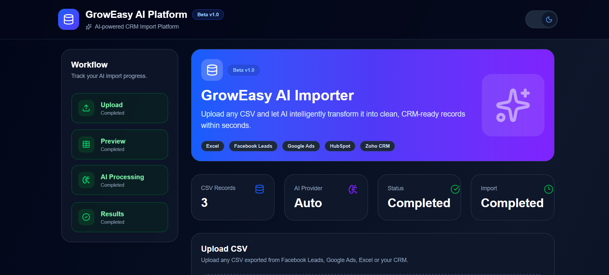
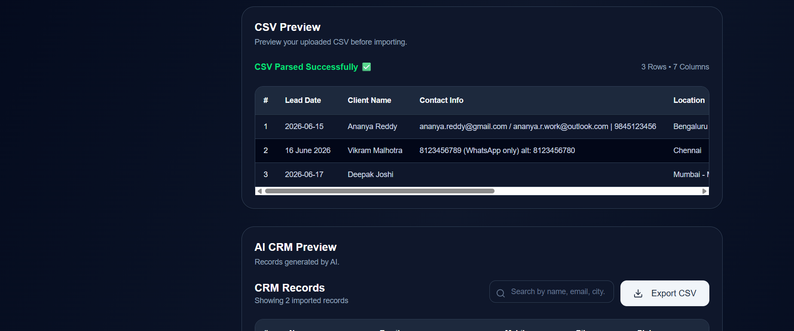
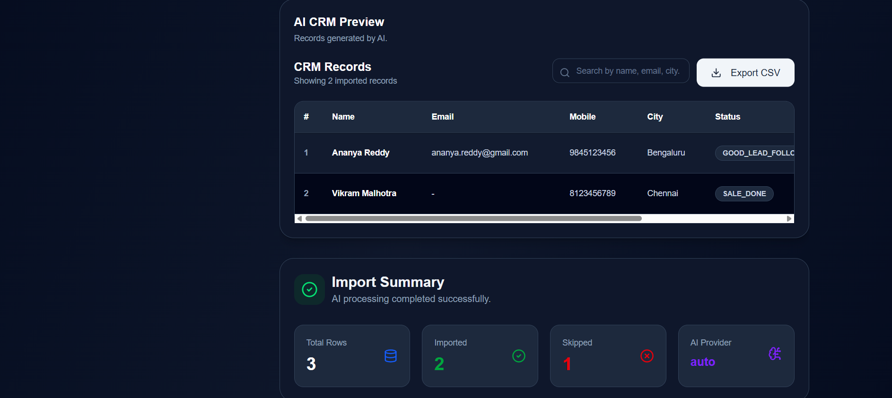
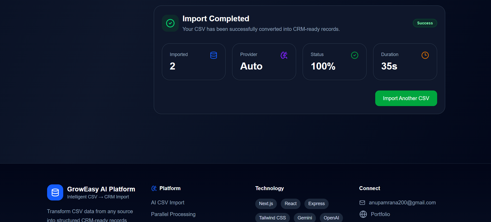
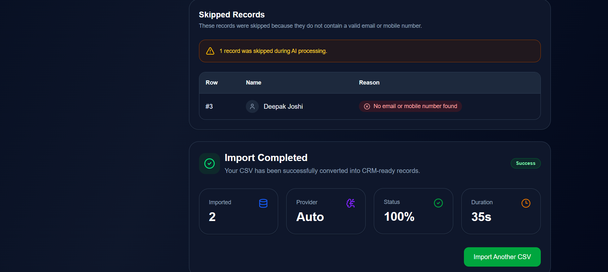

# 🚀 GrowEasy AI Platform

> **An AI-powered CRM Import Platform that intelligently converts CSV files with arbitrary column structures into standardized CRM-ready records using Google Gemini or OpenAI GPT.**


---

# 🌐 Live Demo

### Frontend

https://groweasy-ai-csv-importer-brown.vercel.app/

### Backend API

https://groweasy-ai-csv-importer-hg53.onrender.com/

---

# 📌 Project Overview

GrowEasy AI Platform is a full-stack AI-powered CRM Import Platform that automatically converts CSV files from multiple sources into a standardized CRM format.

Instead of requiring manual column mapping, the platform leverages **Google Gemini** and **OpenAI GPT** to understand arbitrary CSV structures, identify important customer information, extract CRM fields, validate AI responses, skip invalid records, and generate CRM-ready data.

The platform is designed to work with CSV exports from:

- Facebook Leads
- Google Ads
- HubSpot
- Zoho CRM
- Excel
- Custom CRM systems
- Marketing Agencies
- Real Estate Portals

---

# ✨ Features

## 📂 CSV Upload

- Drag & Drop Upload
- File Picker Upload
- CSV Validation
- CSV Preview
- Supports arbitrary CSV structures

---

## 🤖 AI Processing

- Google Gemini Support
- OpenAI GPT Support
- Auto Provider Selection
- Intelligent Field Mapping
- Parallel AI Workers
- Batch Processing
- AI Response Validation
- Smart Progress Tracking
- Dynamic Progress Animation

---

## 📋 CRM Extraction

Automatically extracts:

- Name
- Email
- Mobile Number
- Country Code
- Company
- City
- State
- Country
- Lead Owner
- CRM Status
- CRM Notes
- Data Source
- Possession Time
- Description
- Created Date

---

## 🧠 Smart AI Capabilities

- Understands arbitrary column names
- Detects context automatically
- Handles multiple phone numbers
- Handles multiple email addresses
- Infers missing CRM fields
- Detects CRM Status
- Generates CRM Notes
- Never invents missing values
- Skips invalid records
- Produces standardized CRM output

---

## 📊 Dashboard

- Workflow Tracker
- Live Import Status
- CSV Record Counter
- AI Provider Display
- Import Progress
- Processing Timer
- Import Summary
- Skipped Record Summary

---

## 📑 AI CRM Preview

- Search Records
- Expandable Row Details
- Responsive Table
- Status Badges
- Export Processed CSV
- Dark Mode
- Modern Animations

---

# 🏗 System Architecture

```text
                  CSV Upload
                       │
                       ▼
            PapaParse (Frontend)
                       │
                       ▼
              Express REST API
                       │
                       ▼
              CSV Normalization
                       │
                       ▼
              Batch Generation
                       │
                       ▼
       Parallel AI Processing Workers
      (Google Gemini / OpenAI GPT)
                       │
                       ▼
          AI Response Validation
                       │
                       ▼
           CRM Record Generation
                       │
                       ▼
            Import Summary
                       │
                       ▼
            CRM-ready CSV Export
```

---

# 🛠 Tech Stack

## Frontend

- Next.js 16
- React 19
- Tailwind CSS v4
- Axios
- PapaParse
- Framer Motion
- Lucide React
- Sonner

---

## Backend

- Node.js
- Express.js
- Multer
- CORS
- Zod
- CSV Parser

---

## AI

- Google Gemini
- OpenAI GPT

---

# 📁 Project Structure

```
groweasy-ai-csv-importer

├── client
│   ├── src
│   │   ├── app
│   │   ├── components
│   │   ├── context
│   │   ├── hooks
│   │   ├── services
│   │   └── lib
│
├── server
│   ├── src
│   │   ├── config
│   │   ├── controllers
│   │   ├── middleware
│   │   ├── prompts
│   │   ├── routes
│   │   ├── services
│   │   ├── validators
│   │   └── utils
│
└── README.md
```

---

# ⚙ Environment Variables

Create a `.env` file inside the **server** directory.

```env
PORT=5000

GOOGLE_API_KEY=your_gemini_api_key

OPENAI_API_KEY=your_openai_api_key
```

---

# 🚀 Installation

Clone the repository

```bash
git clone https://github.com/anupamrana200/groweasy-ai-csv-importer.git
```

Move into the project

```bash
cd groweasy-ai-csv-importer
```

---

## Install Frontend

```bash
cd client

npm install
```

---

## Install Backend

```bash
cd server

npm install
```

---

# ▶ Running Locally

## Backend

```bash
cd server

npm run dev
```

Runs on

```
http://localhost:5000
```

---

## Frontend

```bash
cd client

npm run dev
```

Runs on

```
http://localhost:3000
```

---

# 📡 API Endpoints

## Import CSV

```
POST /api/import
```

---

## Import Progress

```
GET /api/progress
```

---

## Health Check

```
GET /
```

---

# 🌙 User Experience

- Responsive Design
- Light Theme
- Dark Theme
- Animated Components
- AI Processing Dashboard
- Expandable CRM Records
- Modern UI
- Mobile Friendly

---

# 📸 Screenshots

## Dashboard



---

## CSV Preview



---

## AI CRM Preview



---

## Import Summary



---

## Skipped Records

## 

# 📈 Future Improvements

- User Authentication
- Import History
- Duplicate Detection
- AI Confidence Score
- Excel Export (.xlsx)
- Editable CRM Records
- Import Templates
- Audit Logs
- Webhooks
- Multi-user Workspace

---

# 👨‍💻 Author

## **Anupam Rana**

Computer Science & Engineering  
University of Calcutta

📧 Email

anupamrana200@gmail.com

📱 Mobile

+91 7063631178

🌐 GitHub

https://github.com/anupamrana200

💼 LinkedIn

https://www.linkedin.com/in/anupam-rana-126143262/

---

# ⭐ Support

If you found this project helpful, please consider giving it a ⭐ on GitHub.

It helps others discover the project and motivates future improvements.

---

# 📄 License

This project is licensed under the **MIT License**.
